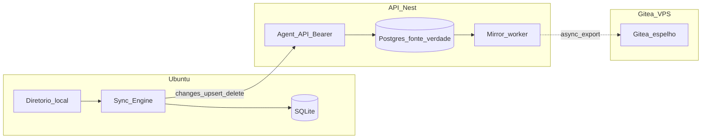

# Cliente Ubuntu OpenSync — plano alinhado ao PRD

Referência: [docs/PRDs/opensync_prd_FULL.md](docs/PRDs/opensync_prd_FULL.md).

---

## Decisão de arquitetura (fixada)

- **Fonte da verdade:** API OpenSync + Postgres (dados de vault por ficheiro: versão, cursor, soft delete, feed ordenado). Supabase continua a tratar auth/identidade do utilizador; o **conteúdo e versão** do sync vivem no modelo persistido pela API (Postgres via Prisma), não no Gitea.
- **Gitea (VPS):** camada **complementar** — espelho assíncrono, export, histórico legível, workflows Git, backup lógico. **Não** é o motor de sync bidirecional nem o centro de reconciliação multi-dispositivo.
- **Fluxo desejado:** `Cliente Ubuntu → API → Postgres` e, em separado, `API/worker → Gitea` (assíncrono). **Evitar:** cliente a sincronizar contra Gitea como centro.
- **Push Git actual (`POST /api/git/:vaultId/push`):** **remover**, não manter como legado. O protocolo único para agentes é **por ficheiro** (`changes` / `upsert` / `delete`). Isto implica migrar [`packages/plugin/src/sync.ts`](packages/plugin/src/sync.ts) e rever rotas web que hoje fazem sync via Git ([`VaultGitSyncService`](apps/api/src/sync/vault-git-sync.service.ts) como caminho **primário** do produto).

**Porquê (resumo):** sync fino (versão por ficheiro, cursor, 409, soft delete, idempotência, rate limit por agente) encaixa em API/DB; centrar em Git força semântica de commits e fragiliza multi-device e deletes. Git permanece útil como espelho e histórico humano, não como fonte operacional.

---

## 1. Plano antigo vs direcção actual

| Tema | Abordagem antiga (descartada) | Direcção actual |
|------|-------------------------------|-----------------|
| Upload agente | Snapshot → `POST .../git/.../push` | `upsert` / `delete` + `base_version` |
| Verdade | Gitea + clone/commit no API | Postgres; Gitea só espelho async |
| Dashboard | Tree/blob via Git | Leitura primária via API que reflecte Postgres |

---

## 2. Gap no repositório

- **A remover ou desactivar após substituição:** [`SyncController`](apps/api/src/sync/sync.controller.ts) push (e uso primário de [`VaultGitSyncService.pushTextFiles`](apps/api/src/sync/vault-git-sync.service.ts) para o fluxo “vault = sync de utilizador”).
- **A implementar:** tabelas e endpoints do PRD sec. 11, com auth Bearer de agente.
- **A repensar:** [`VaultsController` `POST :id/sync`](apps/api/src/vaults/vaults.controller.ts) e [`/api/vaults/[id]/sync`](apps/web/src/app/api/vaults/[id]/sync/route.ts) — devem passar a escrever no **modelo por ficheiro** (e opcionalmente enfileirar job para Gitea), não enviar mapa completo para Git como única verdade.
- **Worker Gitea:** novo pipeline assíncrono a partir de eventos ou polling de `vault_file_changes` (ou equivalente), sem bloquear resposta de `upsert`/`changes`.

---

## 3. Diagrama alvo

---

## 4. Ordem de implementação (ajustada)

1. Backend: `vault_files` + feed + upsert/delete + testes; guard de agente.
2. Migrar **escritas** do dashboard (sync a partir do editor) para o mesmo modelo; desligar dependência de “push git” como verdade.
3. Implementar **worker** Postgres → Gitea; só então remover `POST .../git/.../push` e limpar código morto associado (ou remover antes se nenhum cliente crítico depender, com flag de rollout).
4. Cliente Ubuntu: SQLite, engine, watcher, poller, conflitos.
5. `opensync init`, `.deb`, systemd, docs e CI **e** revisão do onboarding do agente no dashboard (secção 6).

---

## 5. Frontend e VPS

- **Next:** explorador e sync do vault contra **API** que lê/escreve Postgres; Gitea como destino secundário visível opcionalmente (ex. link “ver no Git”) após mirror.
- **VPS Gitea:** capacidade e saúde do worker; falhas no mirror não devem impedir sync do utilizador (PRD 4.1).

---

## 6. Onboarding do agente no vault (revisão de copy e fluxo)

**Objectivo:** quando o utilizador cria um vault e gera a API key do agente, o produto deve orientar **instalação e configuração do novo app Ubuntu** (`opensync-agent`, `.deb`, `opensync init`, `systemd --user`), **não** instalação da skill OpenClaw / plugin como caminho principal.

**Onde rever no código (referências prováveis):**

- Wizard **novo vault** após criação do vault e token: [`apps/web/src/app/(app)/vaults/new/page.tsx`](apps/web/src/app/(app)/vaults/new/page.tsx) (passo que mostra instruções ao utilizador).
- Painel de instruções da skill / agente: [`apps/web/src/components/onboarding/opensync-agent-skill-instructions.tsx`](apps/web/src/components/onboarding/opensync-agent-skill-instructions.tsx) — substituir ou ramificar UI: fluxo **“App Ubuntu”** (primário) vs skill (opcional / documentação avançada, se ainda fizer sentido para power users).
- Página **Git / agente** por vault: [`apps/web/src/app/(app)/dashboard/vaults/[id]/git/page.tsx`](apps/web/src/app/(app)/dashboard/vaults/[id]/git/page.tsx) — alinhar secções “como ligar o agente” ao mesmo messaging (deb + init + variáveis ou `config.json`).
- Copy em [`packages/plugin/skill/SKILL.md`](packages/plugin/skill/SKILL.md) pode permanecer para quem ainda usa o plugin, mas **não** deve ser o texto que o dashboard mostra por defeito ao utilizador típico.

**Conteúdo mínimo das novas instruções (alinhado ao PRD sec. 14):** instalar pacote, correr `opensync init` (directório, `apiUrl`, `vaultId`, token), validar ligação, `systemctl --user enable/start opensync-agent`, link para troubleshooting e página de download.

**Backend:** normalmente **sem** endpoint novo só por causa do copy; se existir campo `Agent.name` default “OpenClaw” em [`VaultsService.createAgentApiTokenForUser`](apps/api/src/vaults/vaults.service.ts), avaliar renomear para algo neutro (ex. “Desktop agent”) para consistência com o produto Ubuntu.

Incluir este trabalho na ordem de implementação **junto ao passo do cliente `.deb` e página de download**, para o utilizador nunca ver instruções da skill sem alternativa clara do app.

---

## Anexo A — Actualização recomendada ao [opensync_prd_FULL.md](docs/PRDs/opensync_prd_FULL.md)

Alinhar o texto canónico à decisão acima (além das melhorias já úteis: prefixo `/api/agent/`, token MVP em ficheiro, métricas SLA).

1. **Secção 4.1 e integração dashboard:** afirmar explicitamente **espelho assíncrono Postgres → Gitea** como desenho preferido (em vez de lista de três opções sem escolha). Esclarecer que o dashboard **não** deve depender de Git como leitura primária após o MVP.
2. **Remover ou reescrever secção 11.7:** deixar de falar em “endpoint legado de push”; indicar que o push Git por agente **não faz parte** do produto-alvo e será **removido** após migração.
3. **Secção 11 / limites:** definir `maxBatchBytes` e limites por ficheiro **no novo contrato** (pode inspirar-se no valor 5 MiB histórico como teto inicial documentado, sem acoplar ao Git).
4. **Glossário:** remover “Legado Git push” como conceito permanente ou substituir por nota histórica “removido em favor do protocolo por ficheiro”.
5. **Onboarding (sec. 14 ou nova subsecção “Agente Ubuntu”):** descrever que, após gerar a API key no vault, o utilizador segue instalação do pacote `opensync-agent` e `opensync init`; skill/plugin OpenClaw como caminho opcional/avançado, não como default do produto.

---

## Anexo B — Rotação de segredos

Tokens expostos em testes ou chat devem ser regenerados no dashboard após validação.
