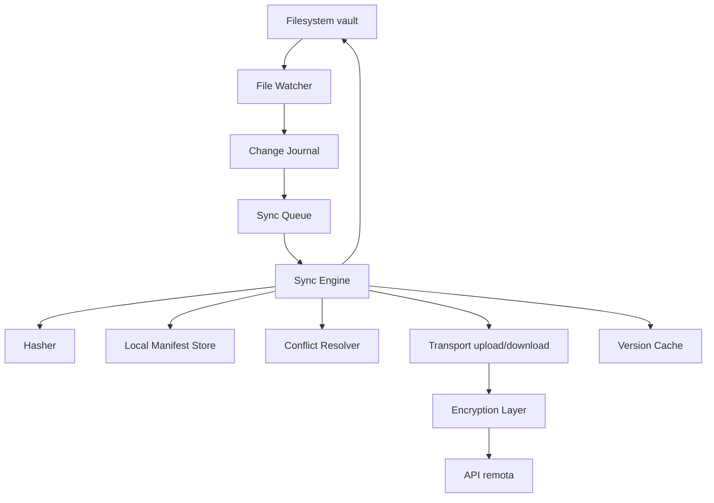

# Arquitetura completa do Sync Engine -- OpenSync

Vault local em filesystem = verdade do usuario. Sync backend = replica versionada e segura. Postgres = metadata e controle. Blob storage = conteudo. SQLite local = estado operacional.

**Premissa:** projeto em teste; pode-se alterar protocolo/contratos sem compromisso com migracao de dados legados.

---

## 1. Principios

1. **File-first:** o vault e uma arvore de ficheiros normais (Markdown, anexos). Nada proprietario no disco.
2. **Offline-first bidirecional:** ler e gravar sempre no filesystem; alteracoes remotas atualizam o ficheiro local no disco assim que detectadas.
3. **Delta-based:** nunca reenviar o vault inteiro; enviar so o que mudou (arquivo, chunk ou operacao conforme o nivel).
4. **Conflitos previsiveis:** tentar merge 3-way -> se falhar, conflict copy -> **nunca** sobrescrever silenciosamente.
5. **Rename/delete corretos:** fileId estavel + tombstones; rename nao e delete+create.
6. **Idempotencia:** repetir qualquer operacao de sync nao corrompe estado.
7. **Delta-ready desde o inicio:** abstrair transporte para trocar de blob completo para delta sem reescrever o engine.

---

## 2. Tres niveis de delta

**Nivel 1 -- Delta por arquivo (MVP)**
- Detecta que `projetos/roadmap.md` mudou, sobe **so esse arquivo**, nao o vault inteiro.
- Hash por arquivo (SHA-256); se hash mudou, envia blob completo desse path.
- **Suficiente para Markdown** (arquivos tipicamente pequenos).

**Nivel 2 -- Delta por chunk (pos-MVP, para binarios grandes)**
- Divide arquivo em blocos (64-256 KB fixos, ou content-defined chunking com rolling hash).
- Envia so os chunks alterados.
- Exemplo: arquivo de 1 MB, so 8 KB mudaram -> envia 1-2 chunks.
- **Recomendado para:** anexos, imagens, PDFs.

**Nivel 3 -- Delta semantico/operacional (futuro, so se necessario)**
- Envia operacoes: `insert linha`, `delete intervalo`, `replace bloco`, `rename path`, `move file`.
- Proximo de CRDT/OT; so para colaboracao quase em tempo real.
- **Nao implementar agora.**

**Estrategia recomendada:**
- Markdown/texto: Nivel 1 (hash + blob por arquivo)
- Binarios grandes: Nivel 2 (chunking + deduplicacao)
- Colaboracao realtime: Nivel 3 (so no futuro, se necessario)

---

## 3. Componentes do cliente



### File Watcher
Escuta eventos do filesystem: `create`, `modify`, `delete`, `rename`.

### Change Journal
**Nao sincroniza direto do watcher.** Grava eventos num journal persistente (SQLite):

```typescript
type JournalEntry = {
  id: string
  type: "create" | "modify" | "delete" | "rename"
  path: string
  detectedAt: string // ISO timestamp
}
```

Isso evita perder mudancas se o app cair. O journal e drenado pelo Sync Queue apos debounce.

### Local Manifest Store
Estado conhecido por ficheiro (SQLite):

```typescript
type ManifestEntry = {
  fileId: string
  path: string
  contentHash: string        // sha256
  size: number
  mtime: number
  remoteVersion: number
  lastSyncedHash: string
  syncState: "synced" | "dirty" | "conflict" | "pending" | "failed"
  lastModifiedByDeviceId: string
}
```

### Sync Queue
Fila serializada por path com concorrencia controlada. Processa journal entries apos debounce (500ms-2s).

### Hasher
SHA-256 por arquivo. Opcionalmente hash por chunk para Nivel 2.

### Transport (Uploader / Downloader)
Interface abstracta entre engine e API:

```typescript
interface Transport {
  pullChanges(vaultId: string, cursor: number): Promise<ChangeSet>
  preparePut(vaultId: string, op: SyncOperation): Promise<SyncDecision>
  uploadBlob(uploadToken: string, data: Buffer): Promise<void>
  commitPut(vaultId: string, path: string): Promise<{ version: number }>
  downloadBlob(vaultId: string, path: string, version?: number): Promise<Buffer>
}
```

Fase A: blob completo. Fase C: delta/patch -- troca so a implementacao, nao a interface.

### Conflict Resolver
Decide na ordem:
1. Fast-forward (so um lado mudou)
2. Merge 3-way com base (ambos mudaram, base existe)
3. Conflict copy (merge falhou ou ficheiros demasiado divergentes)
4. **Nunca** sobrescrever silenciosamente

### Version Cache
Cache local de versoes anteriores (opcional) para suportar merge 3-way e version history.

### Encryption Layer
Encripta antes do upload, desencripta apos download. Transparente para o engine.

---

## 4. Fluxos de sync

### 4.1 Local -> Remoto

```
Usuario edita arquivo
-> watcher detecta
-> journal registra evento
-> debounce 500ms-2s
-> hasher recalcula hash
-> compara com lastSyncedHash
-> se mudou, cria SyncOperation
-> transport.preparePut() envia metadata
-> servidor responde SyncDecision
-> se upload_required: encripta + transport.uploadBlob()
-> transport.commitPut()
-> atualiza manifest local (syncState: "synced")
```

### 4.2 Remoto -> Local

```
Cliente recebe notificacao (SSE/WS) ou poll tick
-> transport.pullChanges(cursor)
-> compara remoteVersion por path com manifest local
-> para cada path com versao nova:
   -> se local limpo (hash local = lastSyncedHash):
      -> transport.downloadBlob()
      -> desencripta
      -> sobrescreve ficheiro no disco
      -> atualiza manifest local
      -> marca evento como "remote-applied" (evitar loop)
   -> se local tambem mudou (hash local != lastSyncedHash):
      -> conflict resolver decide (merge 3-way ou conflict copy)
-> atualiza cursor local
```

### 4.3 Loop prevention

Quando o engine grava um ficheiro baixado do remoto, o watcher vai detectar mudanca. Para evitar loop:

```typescript
// Mapa temporario de escritas suprimidas
const suppressedWrites: Map<string, { hash: string, expiresAt: number }> = new Map()

// Antes de gravar ficheiro remoto:
suppressedWrites.set(path, { hash: newHash, expiresAt: Date.now() + 5000 })
await writeFile(path, content)

// No watcher, ao detectar mudanca:
const suppressed = suppressedWrites.get(path)
if (suppressed && sha256(content) === suppressed.hash) {
  suppressedWrites.delete(path)
  return // ignorar -- escrita do proprio sync
}
```

---

## 5. Estruturas de dados

### FileEntry (manifest remoto e local)

```typescript
type FileEntry = {
  vaultId: string
  path: string
  fileId: string           // UUID estavel -- rename nao muda o fileId
  tombstone: boolean       // true = ficheiro deletado (soft delete)
  size: number
  mimeType: string
  contentHash: string
  chunkHashes?: string[]   // Nivel 2 (futuro)
  baseVersion: number
  currentVersion: number
  lastModifiedAt: string
  lastModifiedByDeviceId: string
}
```

### SyncOperation (cliente -> servidor)

```typescript
type SyncOperation =
  | { type: "put"; path: string; contentHash: string; size: number; baseVersion: number }
  | { type: "delete"; path: string; baseVersion: number }
  | { type: "rename"; fromPath: string; toPath: string; baseVersion: number }
```

### SyncDecision (servidor -> cliente)

```typescript
type SyncDecision =
  | { status: "upload_required"; uploadToken: string }
  | { status: "already_exists"; newVersion: number }
  | { status: "conflict"; serverVersion: number; serverHash: string }
  | { status: "fast_forward"; newVersion: number }
```

---

## 6. Rename e Delete com fileId estavel

**Rename:** o fileId permanece; so o path muda. O servidor entende que e rename, nao delete+create.

```json
{ "fileId": "file_123", "path": "notes/ideia-final.md" }
```

**Delete:** nao apaga do indice remoto. Marca como tombstone:

```json
{ "fileId": "file_123", "tombstone": true, "version": 15 }
```

Isso evita "ressurreicao" do arquivo em outro device offline. Tombstones sao podados (garbage collected) apos periodo configuravel (ex.: 30 dias).

---

## 7. Manifest diff -- o coracao do sync

Cada device mantem um manifesto do vault. Na sincronizacao, o cliente envia:

```json
{
  "deviceId": "dev_1",
  "cursor": 987,
  "entries": [
    { "path": "a.md", "hash": "sha256:111", "version": 10 },
    { "path": "b.md", "hash": "sha256:999", "version": 4 }
  ]
}
```

Servidor compara com manifest remoto e responde:

```json
{
  "pull": [
    { "path": "c.md", "version": 2 }
  ],
  "push": [
    { "path": "b.md", "baseVersion": 4, "uploadRequired": true }
  ],
  "conflicts": []
}
```

Isso reduz brutalmente o trafego e simplifica a logica: o cliente sabe **exatamente** o que puxar e o que empurrar numa unica round-trip.

---

## 8. Conflitos

### Ordem de resolucao

1. **Tentar merge 3-way** (base comum + versao local + versao remota) -- excelente para Markdown.
2. **Se merge falhar** (divergencia grande ou binario): criar **conflict copy** (`nota.conflict-deviceB-2026-04-15.md`).
3. **Nunca** sobrescrever silenciosamente (last-write-wins so com opt-in explicito).

### Quando conflito acontece

Device A parte da versao 10 e edita. Device B parte da versao 10 e edita. Ambos tentam subir versao 11 diferente.

### Pseudocodigo do merge

```typescript
async function resolveConflict(path: string, localContent: string, decision: SyncDecision) {
  const remoteContent = await transport.downloadBlob(vaultId, path, decision.serverVersion)
  const baseContent = await versionCache.get(path, decision.serverVersion - 1) // base comum

  if (baseContent) {
    const merged = merge3way(baseContent, localContent, remoteContent)
    if (merged.success) {
      await writeFile(path, merged.content)
      await transport.preparePut(vaultId, { type: "put", path, contentHash: sha256(merged.content), ... })
      return
    }
  }

  // Merge falhou ou sem base -- conflict copy
  const conflictPath = `${pathWithoutExt}.conflict-${deviceId}-${dateStr}${ext}`
  await writeFile(conflictPath, localContent)
  await writeFile(path, remoteContent) // remoto ganha no path original
  // registar conflito no manifest local
}
```

---

## 9. Algoritmo pratico para Markdown

Markdown e tipicamente pequeno. Nao compensa chunking. Estrategia:

```
debounce da escrita
-> hash do arquivo final
-> se hash mudou, sobe o arquivo inteiro (Nivel 1)
-> mantem historico de versoes
-> usa merge textual 3-way so em conflito
```

```typescript
async function processDirtyFile(path: string) {
  const content = await readFile(path)
  const hash = sha256(content)
  const local = await localManifest.get(path)

  if (local?.lastSyncedHash === hash) return // nada mudou

  const decision = await transport.preparePut(vaultId, {
    type: "put",
    path,
    contentHash: hash,
    size: content.length,
    baseVersion: local?.remoteVersion ?? 0
  })

  if (decision.status === "already_exists") {
    await localManifest.update(path, { lastSyncedHash: hash, remoteVersion: decision.newVersion, syncState: "synced" })
    return
  }

  if (decision.status === "upload_required") {
    const encrypted = encryptionLayer.encrypt(content)
    await transport.uploadBlob(decision.uploadToken, encrypted)
    await localManifest.update(path, { lastSyncedHash: hash, remoteVersion: (local?.remoteVersion ?? 0) + 1, syncState: "synced" })
    return
  }

  if (decision.status === "conflict") {
    await resolveConflict(path, content, decision)
  }
}
```

---

## 10. API remota

### Endpoints

**Buscar mudancas remotas:**
`GET /sync/v1/vaults/:vaultId/changes?cursor=123`

```json
{
  "nextCursor": 130,
  "changes": [
    { "type": "put", "path": "a.md", "version": 11, "hash": "sha256:..." },
    { "type": "delete", "path": "b.md", "version": 5 }
  ]
}
```

**Preparar upload:**
`POST /sync/v1/vaults/:vaultId/prepare-put`

```json
{ "path": "a.md", "hash": "sha256:...", "size": 1234, "baseVersion": 10 }
```

**Upload blob:**
`PUT /sync/v1/uploads/:uploadToken`

**Confirmar commit:**
`POST /sync/v1/vaults/:vaultId/commit-put`

**Deletar:**
`POST /sync/v1/vaults/:vaultId/delete`

**Renomear:**
`POST /sync/v1/vaults/:vaultId/rename`

---

## 11. Modelo de banco remoto

**vaults:**
`id uuid pk, owner_user_id uuid, encryption_mode text, created_at timestamptz`

**devices:**
`id uuid pk, vault_id uuid, name text, last_seen_at timestamptz`

**file_entries:**
`file_id uuid pk, vault_id uuid, path text, current_version int, current_blob_id uuid, content_hash text, tombstone boolean, updated_at timestamptz`

**file_versions:**
`id uuid pk, file_id uuid, version int, blob_id uuid, content_hash text, base_version int, created_by_device_id uuid, created_at timestamptz`

**sync_log (cursor monotonico):**
`seq bigint pk, vault_id uuid, file_id uuid, operation text, version int, path text, created_at timestamptz`

**Blob storage:** `blobs/{vaultId}/{blobId}` -- conteudo criptografado (ou comprimido + criptografado).

---

## 12. Criptografia ponta a ponta (E2EE)

**No cliente:**
- Gera chave mestra do vault, derivada de senha com KDF forte (Argon2id).
- Cada arquivo/bloco pode usar data key derivada.

**No servidor:**
- So recebe blob criptografado; nunca ve conteudo puro.

**Fase:** implementar **depois** do pipeline manifest + blob estar estavel. A Encryption Layer no cliente e transparente para o engine.

---

## 13. Offline-first: requisitos

- Journal persistente (sobrevive a crash).
- Manifest local completo (opera sem rede).
- Fila de retry com backoff exponencial.
- Operacoes idempotentes: `prepare-put` e `commit-put` podem ser repetidos sem quebrar nada.
- Ao reconectar: **primeiro puxa** alteracoes remotas, reconcilia, **depois** envia pendentes.

---

## 14. O que fazer no MVP

- Vault local em filesystem.
- Manifest local (SQLite).
- Change journal persistente.
- File watcher + debounce.
- Hash SHA-256 por arquivo.
- Upload por arquivo (Nivel 1).
- Sync incremental por cursor.
- Tombstones + fileId estavel.
- Rename tracking.
- Conflict copy + merge textual 3-way opcional.
- Loop prevention (suppressedWrites).
- Transport layer abstracto (blob completo, delta-ready).
- Version history (file_versions no servidor).

---

## 15. O que NAO fazer no inicio

- CRDT em tudo.
- Delta binario sofisticado para `.md`.
- WebSocket obrigatorio (poller e suficiente para MVP; push e Fase B).
- Postgres como source of truth do **conteudo** (so metadata).
- Sync baseado em `modifiedAt` sozinho (usar sempre: hash + version + tombstone + fileId estavel).
- Last-write-wins como default.
- E2EE antes do pipeline estar estavel.

---

## 16. Fases de implementacao

### Fase A -- MVP robusto

- Componentes do cliente: watcher, journal, manifest, queue, hasher, transport (blob), conflict resolver.
- API: changes, prepare-put, upload, commit-put, delete, rename.
- Modelo remoto: file_entries, file_versions, sync_log, blob storage.
- Nivel 1 delta (por arquivo).
- Merge 3-way + conflict copy.
- fileId estavel + tombstones.
- Loop prevention.

### Fase B -- Fluidez

- SSE/WebSocket para push de alteracoes; poller com intervalo maior como fallback.
- Manifest diff numa unica round-trip (cliente envia entries, servidor responde pull/push/conflicts).
- Debouncing adaptativo por path.

### Fase C -- Eficiencia

- Nivel 2 delta (chunking) para binarios grandes.
- E2EE (Encryption Layer).
- Version history no cliente.
- Garbage collection de tombstones.

### Fase D -- Colaboracao (so se necessario)

- Nivel 3 delta (operacional/CRDT) para docs colaborativos especificos.
- **Nao** para todo o vault.

---

## 17. Alinhamento com codigo actual

- Hoje: [`apps/opensync-ubuntu/src/engine.ts`](apps/opensync-ubuntu/src/engine.ts), [`packages/sync/src/merge.ts`](packages/sync/src/merge.ts), [`docs/PRDs/opensync_prd_FULL.md`](docs/PRDs/opensync_prd_FULL.md) -- API-first operacional, merge por linhas, 409 + retry, `last_synced_hash` ja existe.
- Evolucao: refactoring para introduzir journal, manifest store, transport layer abstracto, fileId estavel; novos endpoints de API (prepare-put, commit-put, rename); modelo remoto com file_versions e sync_log.
