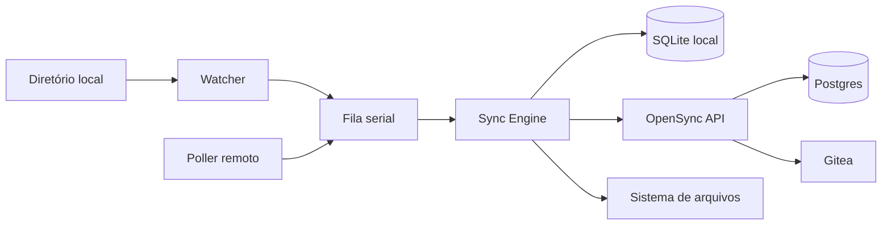

# OpenSync — PRD unificado (Cliente Ubuntu, sync bidirecional)

**Documento canônico técnico.** Consolida e substitui o uso fragmentado de `PRD_1.md`, `PRD_2.md` e `PRD_3.md` para planejamento e implementação.  
**Produto:** agente em Ubuntu que sincroniza **bidirecionalmente** um diretório local com um vault **opensync.space** (a **API** é a fonte da verdade operacional).

### Relação com a visão estratégica

- **[docs/VISION.md](../VISION.md)** — missão, problema, proposta de valor, pilares, superfícies do produto (API + cliente Ubuntu + dashboard) e roadmap em nível executivo.  
- **Este PRD** — especificação detalhada: SQLite local, contratos HTTP, matriz de conflitos, systemd, métricas, pseudocódigo do sync engine e ordem de implementação.  
Em caso de divergência entre rascunhos de plano e estes documentos, prevalecem **VISION + PRD**.

---

## 1. Visão do produto (escopo técnico)

Esta seção desdobra a visão de [docs/VISION.md](../VISION.md) para o **MVP do cliente Ubuntu** e o **backend de sync**.

- Manter arquivos (prioridade: texto) consistentes entre a máquina do usuário e o vault remoto.
- Instalação simples, configuração guiada, execução contínua em background.
- Sincronização **incremental**, com **versionamento por arquivo**, **detecção de conflitos** e **sem perda silenciosa de dados**.
- Objetivo de experiência: equivalente a um **“Obsidian Sync self-hosted + API-first”**, coerente com a plataforma **OpenSync (opensync.space)**.

---

## 2. Escopo do MVP

### 2.1 Incluído

| Área | Itens |
|------|--------|
| Sync | Bidirecional (upload + download), deleções sincronizadas |
| Local | Watcher de alterações (create / update / delete; rename heurístico) |
| Remoto | Polling periódico (ex.: 15–30 s, configurável) |
| Estado | SQLite local (metadados + cursor remoto) |
| Versões | Controle por arquivo no remoto; `base_version` nas escritas |
| Conflitos | Sem merge automático; cópia no filesystem + registro em log/estado |
| Empacotamento | `.deb` |
| Runtime | `systemd --user` (auto-restart, logs via journal) |
| Onboarding | `opensync init` (wizard/CLI guiada) |

### 2.2 Fora do MVP

- Binários grandes / chunking de payload
- Merge inteligente (diff3 etc.)
- WebSocket / SSE para tempo real
- Criptografia ponta a ponta
- UI desktop completa
- Criação de vault só pelo app (sem dashboard) — fase posterior
- Sync seletivo por regras remotas complexas
- Histórico de versões no cliente
- Múltiplos perfis de sync avançados

### 2.3 Limites e premissas do MVP

- Foco em **arquivos de texto**; diretórios de tamanho moderado.
- **Conflito > sobrescrita silenciosa**; consistência priorizada sobre velocidade extrema.
- Vault criado no **dashboard**; token gerado no dashboard e colado no instalador (documentar explicitamente).

---

## 3. Princípios do sistema

1. **API OpenSync = fonte da verdade** — o cliente mantém cache/estado, mas não decide versão final sozinho.
2. **Nunca sobrescrever sem validar versão** — uploads/deletes condicionados a `base_version` (ou null para arquivo novo).
3. **Conflito é melhor que perda de dados** — em dúvida, preservar as duas versões.
4. **Idempotência** — repetir requests não corrompe estado.
5. **Resiliência** — falhas de rede temporárias não podem causar perda; retry com backoff.
6. **Watcher + polling** — watcher sozinho não basta; polling como rede de segurança.
7. **Uma sync por vez** — fila serial (ou lock global) para evitar corrida interna.
8. **Simplicidade no MVP** — protocolo claro e robusto > automações frágeis.

---

## 4. Arquitetura geral



### 4.1 Decisão crítica: DB/API vs Gitea

- **Recomendado:** Postgres/API como **verdade operacional** do sync (arquivo + versão + cursor + soft delete).
- **Gitea:** espelho/export, histórico complementar, integração Git — **não** como motor primário de sync bidirecional por arquivo.
- **Motivo:** Git pensa em commits; sync multi-dispositivo com cursor incremental e conflitos por arquivo fica mais simples e previsível na API/DB.
- **Operação:** falha no Gitea **não** deve bloquear o sync principal.

---

## 5. Componentes do cliente

| Componente | Responsabilidade |
|------------|------------------|
| **Sync Engine** | Orquestra upload/download/delete/conflito; fila serial; atualiza SQLite |
| **Watcher** | Eventos locais (chokidar em Node, notify em Rust, etc.); ignorar temporários/padrões |
| **Poller** | Intervalo fixo; chama feed de mudanças com cursor |
| **SQLite** | Estado por arquivo, cursor, `deviceId`, flags de conflito |
| **Config** | `config.json` + parâmetros; token no keyring |
| **Agente / serviço** | Processo long-running sob `systemd --user` |

### 5.1 Tipos de job sugeridos (implementação)

- `FULL_RECONCILE` — primeiro run, reindexação, recuperação grave  
- `LOCAL_CHANGE` — evento do watcher (com debounce por caminho)  
- `REMOTE_CHANGE` — tick do poller  

---

## 6. Modelo de dados local (SQLite)

### 6.1 Tabela `files_state`

Campos mínimos (unifica PRDs anteriores + campo necessário para regras de conflito do PRD_3):

```sql
CREATE TABLE files_state (
  path TEXT PRIMARY KEY,
  content_hash TEXT,
  size_bytes INTEGER,
  mtime_ms INTEGER,
  remote_version TEXT,
  last_synced_hash TEXT,
  last_synced_at TEXT,
  is_deleted INTEGER DEFAULT 0
);
```

- **`last_synced_hash`:** hash do conteúdo conforme último sync bem-sucedido; essencial para distinguir “usuário editou desde o sync” vs “ainda igual ao último estado conhecido”.

### 6.2 Tabela `sync_meta`

```sql
CREATE TABLE sync_meta (
  key TEXT PRIMARY KEY,
  value TEXT
);
```

Chaves conceituais: `remote_cursor`, `device_id`, `last_full_scan` (opcional), flags de conflito por path se preferir tabela separada.

### 6.3 Extensões opcionais

- Tabela ou colunas para **conflitos pendentes** (`markConflict` no pseudocódigo de referência).
- Índices conforme volume de arquivos.

---

## 7. Modelo conceitual remoto (por arquivo)

Cada arquivo no vault deve suportar:

- `path`, `content` (ou referência para download), `version`, `updated_at`, `deleted_at` (soft delete)
- Sequência/`change_id` monotônica para ordenação do feed

---

## 8. Eventos e regras de sincronização

### 8.1 Eventos locais

- `LOCAL_CREATE`, `LOCAL_UPDATE`, `LOCAL_DELETE`, `LOCAL_RENAME` (heurístico; MVP pode tratar rename como delete+create)

### 8.2 Eventos remotos (feed)

- `REMOTE_UPSERT`, `REMOTE_DELETE`

### 8.3 Matriz de decisão (resumo)

| Situação | Ação |
|----------|------|
| Só local mudou | Upload (se versão remota base bater) |
| Só remoto mudou | Download / delete local conforme feed |
| Local e remoto divergiram desde último sync | **Conflito** |
| Delete local; remoto estável | Propagar delete com `base_version` |
| Delete remoto; local igual ao último sync | Remover local |
| Delete de um lado + alteração do outro | **Conflito** |
| Delete em ambos | Convergência (no-op / estado deletado) |

### 8.4 Fluxo local → remoto (upload)

1. Debounce (ex.: 2–5 s por path).  
2. Calcular hash; comparar com estado local; ignorar no-op.  
3. Respeitar `maxFileSizeBytes` / limites de batch.  
4. `POST upsert` com `base_version` = última `remote_version` conhecida (ou null se novo).  
5. `409` → tratar conflito (preservar local; buscar conteúdo remoto para cópia de conflito se necessário).

### 8.5 Fluxo remoto → local (download)

1. `GET changes?cursor=...`.  
2. Para cada mudança: se local não divergiu do `last_synced_hash`, aplicar; senão, conflito.  
3. Atualizar `remote_cursor` ao final do lote processado.

### 8.6 Mitigação de loop de sync

- Marcar escritas **originadas pelo agente** (ou comparar hash após write).  
- Debounce; não re-enfileirar job equivalente pendente.

---

## 9. Conflitos

**Definição:** o mesmo path foi alterado de forma concorrente no local e no remoto desde o último estado sincronizado conhecido.

**Estratégia MVP:**

- Não fazer merge automático de conteúdo.
- Preservar ambas as versões no disco.
- Registrar em log; opcionalmente marcar no DB para CLI/UI futura.

**Padrão de nome (exemplo):**

- `arquivo (conflict remote 2026-04-09T15-42-11).md`  
- `arquivo (conflict local 2026-04-09T15-42-11).md`  

**Recomendação de segurança para MVP:** manter o **arquivo local atual** no path principal e gravar a versão **remota** em arquivo de conflito quando a aplicação direta colidir (alinhado ao pseudocódigo detalhado do PRD_3).

---

## 10. Deleções

- Remoto: **soft delete** (`deleted_at` + entrada no feed).  
- Cliente: envia delete com `base_version`; mismatch → conflito.  
- Purge físico no servidor, se existir, **fora** do caminho crítico de sync.

---

## 11. API backend — requisitos (MVP bidirecional)

O backend “só push” não basta; é necessário modelo **por arquivo + versão + cursor**.

### 11.1 Feed incremental

`GET /api/vaults/:vaultId/changes?cursor=<cursor>`  
`Authorization: Bearer <agent_token>`

**Resposta (exemplo):**

```json
{
  "changes": [
    {
      "change_id": 101,
      "path": "notes/a.md",
      "version": "v124",
      "deleted": false,
      "content": "# Novo conteúdo",
      "updated_at": "2026-04-09T12:00:00Z"
    },
    {
      "change_id": 102,
      "path": "notes/b.md",
      "version": "v009",
      "deleted": true,
      "updated_at": "2026-04-09T12:01:00Z"
    }
  ],
  "next_cursor": "102"
}
```

- Ordenação estável; payload pode evoluir para conteúdo por URL separada se necessário.

### 11.2 Upsert com versão

`POST /api/vaults/:vaultId/files/upsert`

```json
{
  "path": "notes/a.md",
  "content": "# conteúdo",
  "base_version": "v123"
}
```

- Arquivo novo: `base_version` null.  
- Se divergir da versão atual no servidor: **409 Conflict**.  
- Sucesso retorna `path`, `version`, `updated_at`.

### 11.3 Delete com versão

`POST /api/vaults/:vaultId/files/delete` (ou contrato equivalente documentado)

```json
{
  "path": "notes/a.md",
  "base_version": "v124"
}
```

- Divergência → 409; sucesso → soft delete + nova versão + registro no feed.

### 11.4 Leitura pontual (opcional)

`GET /api/vaults/:vaultId/files/content?path=...` — útil em conflitos ou se o feed não trouxer corpo completo.

### 11.5 Esquema remoto sugerido

**`vault_files`:**

```sql
CREATE TABLE vault_files (
  id UUID PRIMARY KEY,
  vault_id UUID NOT NULL,
  path TEXT NOT NULL,
  content TEXT,
  version TEXT NOT NULL,
  content_hash TEXT,
  size_bytes BIGINT,
  updated_at TIMESTAMP NOT NULL,
  deleted_at TIMESTAMP NULL,
  UNIQUE (vault_id, path)
);
```

**`vault_file_changes` (feed):**

```sql
CREATE TABLE vault_file_changes (
  id BIGSERIAL PRIMARY KEY,
  vault_id UUID NOT NULL,
  path TEXT NOT NULL,
  version TEXT NOT NULL,
  change_type TEXT NOT NULL,
  content TEXT NULL,
  updated_at TIMESTAMP NOT NULL
);
```

### 11.6 Requisitos transversais backend

- Autenticação por token de agente (ex.: `Bearer osk_...`).  
- Rate limit por agente/vault.  
- Logs por request; respostas estáveis; idempotência onde aplicável.  
- Limite de payload documentado; auditoria básica.

### 11.7 Compatibilidade

- Endpoint legado de push pode permanecer para bootstrap; o MVP bidirecional deve usar os endpoints orientados a arquivo/versionamento.

---

## 12. Ubuntu: systemd e operações

**Unit exemplo** (`~/.config/systemd/user/opensync-agent.service` ou nome alinhado ao binário):

```ini
[Unit]
Description=OpenSync Agent
After=network-online.target

[Service]
ExecStart=/usr/bin/opensync-agent run
Restart=always
RestartSec=5
Environment=NODE_ENV=production

[Install]
WantedBy=default.target
```

**Comandos úteis:**

```bash
systemctl --user daemon-reload
systemctl --user enable opensync-agent
systemctl --user start opensync-agent
systemctl --user status opensync-agent
journalctl --user -u opensync-agent -f
```

---

## 13. Configuração

**Arquivo:** `~/.config/opensync/config.json`

```json
{
  "apiUrl": "https://api.opensync.space/api",
  "vaultId": "xxxxxxxx-xxxx-xxxx-xxxx-xxxxxxxxxxxx",
  "syncDir": "/home/user/Documents/OpenSyncVault",
  "pollIntervalSeconds": 20,
  "ignore": [
    ".git",
    "node_modules",
    ".cache",
    ".DS_Store"
  ],
  "maxFileSizeBytes": 1048576,
  "maxBatchBytes": 5242880
}
```

- **Token:** keyring / Secret Service; não persistir em claro em produção madura.  
- **`deviceId`:** gerado e persistido no SQLite/`sync_meta`.  
- **Padrões extras de ignore (referência):** `*.tmp`, `*.swp`, `.git/**`, etc.

---

## 14. Instalação e `opensync init`

1. Instalar `.deb` (`apt` / `dpkg`).  
2. Executar `opensync init`.  
3. Coletar: diretório, API URL, vault ID, token.  
4. Validar: diretório existe/leitura/escrita; API responde; token e permissões no vault.  
5. Salvar config; habilitar serviço user; scan inicial; iniciar sync.

**Mensagem esperada (exemplo):** config salva, serviço habilitado, sync inicial iniciada.

---

## 15. Métricas de sucesso e observabilidade

### 15.1 Métricas técnicas

- Latência média local → envio: **< 2 s** em condições normais.  
- Latência remoto → aplicação local: **< intervalo de poll** no MVP (ex. ~30 s com poll de 20–30 s).  
- Taxa de erro de sync: **< 1%**.  
- Zero perda silenciosa; conflitos detectados corretamente.  
- CPU idle baixo; restart automático após falha.

### 15.2 Métricas de produto

- Instalação sem suporte técnico pesado.  
- Usuário consegue entender quando há conflito (logs/mensagens).  
- Sync sobrevive a reboot/login.  
- Suporte diagnostica via logs.

### 15.3 Eventos recomendados para log/telemetria futura

`agent_started`, `agent_stopped`, `initial_scan_started`, `initial_scan_finished`, `local_change_detected`, `local_change_synced`, `remote_poll_started`, `remote_poll_finished`, `remote_change_applied`, `remote_delete_applied`, `conflict_created`, `sync_error`, `auth_error`, `rate_limit_received`, além de tempo e tamanho por operação.

---

## 16. Riscos e mitigações

| Risco | Mitigação |
|-------|-----------|
| Conflitos frequentes (multi-dispositivo) | Versão por arquivo; cópias; logs; UI futura |
| Loop de sync | Ignorar writes do agente; debounce; hash; dedupe de jobs |
| Arquivos grandes | Limite por arquivo/batch; chunking fase futura |
| Muitos arquivos | Scan/index incremental; SQLite; ignore |
| Rename mal detectado | Heurística; MVP aceita delete+create |
| Token exposto | Keyring; rotação; revogação por dispositivo (futuro) |
| Corrida local/remoto | Fila serial; lock; snapshot por operação |
| Queda de rede | Retry/backoff; estado persistido |
| Backend incompleto | Implementar feed + upsert/delete versionados primeiro |

---

## 17. Roadmap pós-MVP (fases)

- **Fase 2:** Criação de vault no app (login); deep link; painel local simples; ignore rules avançadas.  
- **Fase 3:** WebSocket/SSE; resolução assistida de conflito; merge textual; múltiplos vaults; sync seletivo.  
- **Fase 4:** UI desktop completa; auto-update; telemetria; gestão/revogação de dispositivos no dashboard.  
- **Fase 5:** E2E crypto; binários + chunking; **delta sync** / compressão; offline-first mais rico; histórico local de versões.

---

## 18. Ordem sugerida de implementação

1. **Backend:** tabelas `vault_files` / `vault_file_changes`; `changes` + `upsert` + `delete` com `base_version` e 409.  
2. **Cliente:** SQLite + `deviceId` + carregar config/secrets.  
3. **Engine:** fila serial + `FULL_RECONCILE` + worker.  
4. **Watcher** com debounce + ignore + limite de tamanho.  
5. **Poller** + aplicação de mudanças remotas + atualização de cursor.  
6. **Conflitos** (nomes de arquivo + opcional marcação no DB).  
7. **`opensync init` + validações.**  
8. **Pacote `.deb` + unit systemd --user.**  
9. **Observabilidade** (eventos da seção 15.3) e ajuste de métricas.

---

## 19. Referência: pseudocódigo do Sync Engine

Estruturas conceituais:

```
Config: apiUrl, vaultId, syncDir, pollIntervalSeconds, ignore[], maxFileSizeBytes, maxBatchBytes
FileState: path, contentHash, sizeBytes, mtimeMs, remoteVersion, lastSyncedHash, lastSyncedAt, isDeleted
SyncMeta: remoteCursor, deviceId
Job: LOCAL_SCAN | LOCAL_CHANGE | REMOTE_CHANGE | FULL_RECONCILE
```

**Inicialização:**

```
init():
  config = loadConfig()
  secrets = loadSecrets()
  db = openSQLite(); ensureSchema(db); ensureDeviceId(db)
  validateConfig(config, secrets)
  queue = createSerialQueue()
  watcher = createWatcher(config.syncDir, config.ignore)
  poller = createPoller(config.pollIntervalSeconds)
  runInitialScan(queue, config, db)
  startWatcher(watcher, queue)
  startPoller(poller, queue)
  startWorker(queue, config, db, secrets)
```

**Fila serial (esboço):**

```
enqueue(queue, job): dedupe jobs equivalentes pendentes
worker: processa um job por vez; try/catch/log; flag processing
```

**Scan inicial / reconcile:**

```
FULL_RECONCILE: varre disco (respeitando ignore e max size) → enfileira LOCAL_CHANGE por arquivo → enfileira REMOTE_CHANGE
```

**Mudança local (resumo):**

```
snapshot = ler arquivo ou ausência
se ausente → processLocalDelete (API delete com base_version)
se hash == lastSyncedHash e não deletado → return
upsert com base_version = state.remoteVersion
409 → handleLocalRemoteConflict (ex.: buscar remoto, gravar cópia conflito, marcar estado)
sucesso → atualizar files_state com remoteVersion e lastSyncedHash
```

**Mudanças remotas (resumo):**

```
changes = apiGetChanges(cursor)
para cada change: applyRemoteChange
atualizar remoteCursor
```

**Aplicar upsert remoto:**

```
se arquivo não existe localmente → writeRemoteFile
se local.hash == lastSyncedHash → writeRemoteFile
senão → createConflictCopyFromRemote (preservar regra do MVP)
```

**Aplicar delete remoto:**

```
se não existe local → atualizar estado
se local.hash == lastSyncedHash → apagar arquivo + estado
senão → createConflictCopyBeforeDelete + log
```

**Retry (esboço):**

```
Não retentar indefinidamente em 400/401/403/404/409
Backoff exponencial para erros transitórios; máximo de tentativas
```

**APIs conceituais:** `apiGetChanges`, `apiUpsertFile`, `apiDeleteFile`, `apiGetFileContent`.

---

## 19.1 Postgres como verdade operacional e Gitea como espelho

- **Fonte da verdade (MVP actual):** o estado dos ficheiros do vault vive em **Postgres** (`vault_files`, `vault_file_changes`). Leituras do dashboard e do agente usam a API sobre estas tabelas; **não** há push Git síncrono legado para o cliente.
- **Snapshot confiável:** `POST .../files/snapshot` (dashboard ou token de agente) substitui o vault pelo mapa enviado. Um **objeto vazio `{}`** significa **limpar o vault** (soft-delete de todos os ficheiros activos), útil para “esvaziar” remoto ou alinhar após wipe local.
- **Backfill Gitea → Postgres:** na primeira abertura, se **não existir nenhuma linha** em `vault_files` para esse vault, o backend pode copiar o conteúdo textual do repo Gitea para Postgres **uma vez**; se já existir qualquer linha (mesmo soft-deleted), o backfill **não** corre, para não apagar histórico por engano.
- **Espelho assíncrono:** um worker periódico envia o mapa actual de ficheiros activos do Postgres para o Gitea (espelho legível/Git), sem bloquear o sync cliente ↔ API.
- **Agente Ubuntu:** qualquer pasta local configurável; **opensync-agent** + token é o caminho principal de onboarding; skill/plugin Cursor é **opcional**. O feed `GET .../changes` pode incluir conteúdo por alteração — para vaults muito grandes, tratar **paginação / payload** como dívida técnica a endurecer (limites, cursores, ou conteúdo lazy).

---

## 20. Glossário rápido

- **Cursor:** marca no feed incremental de mudanças do vault.  
- **Soft delete:** registro lógico removido com `deleted_at`, ainda visível no protocolo de sync.  
- **Base version:** versão remota que o cliente acredita ser a atual ao enviar uma escrita.

---

*Fim do PRD unificado.*
