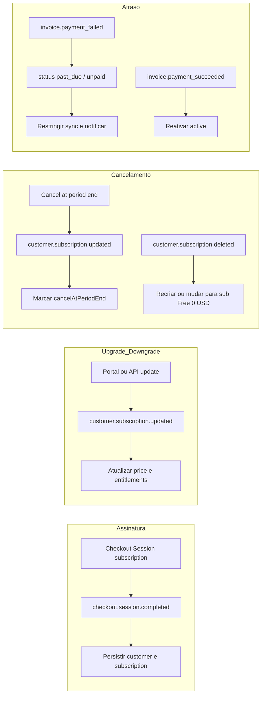

# Plano de implementação: assinaturas Stripe (OpenSync)

Documento de referência para billing recorrente com Stripe (Checkout, webhooks, portal), alinhado ao projecto **SuperSquad** como inspiração de arquitectura. O módulo de billing na API está ainda por implementar.

## Checklist de entrega

- [ ] Alinhar `STRIPE_*` com o backend SuperSquad (mesma conta de teste, se aplicável); webhook dedicado OpenSync; variáveis `STRIPE_PRICE_*` (free $0, plus/pro/business mensal+anual; enterprise por contrato).
- [ ] Migração Prisma: campos de assinatura no `Profile` (ou `BillingSubscription`) + tabela `stripe_webhook_event` (idempotência).
- [ ] `BillingModule`: cliente Stripe, checkout, portal, webhandlers (espelho reduzido do SuperSquad).
- [ ] Web: checkout e settings para `free` / `plus` / `pro` / `business` / `enterprise`; rotas success/cancel; CTA enterprise.
- [ ] Serviço de entitlements (cofres, histórico, GB **e features**: partilha, publicação, MCP, agente de edição) + gates na API; banner `past_due`.
- [ ] Fase 2: add-ons, cross-sell, `subscription.update` com vários items e política de proration.

## Contexto no código OpenSync

| Área | Estado |
|------|--------|
| API | [`BillingModule`](../../apps/api/src/billing/billing.module.ts) vazio; importado em [`app.module.ts`](../../apps/api/src/app.module.ts). |
| Prisma | [`Profile`](../../apps/api/prisma/models/profile.prisma): `plan` (default `free`), `stripeCustomerId`. Sem tabelas de subscrição / webhook. |
| Web | [`sync-checkout-view.tsx`](../../apps/web/src/components/app/sync-checkout-view.tsx): UI legada Standard/Plus e preços hardcoded; botão de pagamento sem API. [`settings/page.tsx`](../../apps/web/src/app/(app)/settings/page.tsx): links a actualizar para os novos slugs. |

## Referência SuperSquad (fora do repo OpenSync)

Assume-se que `opensync` e `supersquad` vivem no mesmo directório pai (ex.: `repos/`).

| Recurso | Caminho relativo |
|---------|-------------------|
| Controller billing | `../../../supersquad/apps/backend/src/api/billing/billing.controller.ts` |
| Webhooks / `handleStripeWebhook` | `../../../supersquad/apps/backend/src/api/billing/billing.service.ts` |
| Idempotência webhook | `../../../supersquad/apps/backend/src/api/billing/services/billing-stripe-webhook.service.ts` |
| Prisma billing (referência) | `../../../supersquad/apps/backend/prisma/models/05-billing.prisma` |
| Doc sistema | `../../../supersquad/apps/backend/docs/BILLING_SYSTEM.md` |
| Checkout frontend | `../../../supersquad/apps/frontend/STRIPE_SETUP.md` |

## Credenciais e webhook

- Copiar `STRIPE_SECRET_KEY` (e chave pública se necessário) de `supersquad/apps/backend/.env` para `opensync/apps/api/.env`, conforme política da equipa.
- `STRIPE_WEBHOOK_SECRET`: **um secret por URL de endpoint**. O endpoint OpenSync (ex. `POST /billing/webhooks/stripe`) precisa do seu próprio `whsec_...` no Stripe Dashboard ou Stripe CLI.
- Variáveis já documentadas: [`apps/api/.env.example`](../../apps/api/.env.example).

## Catálogo: planos (slugs)

Slugs estáveis: `free`, `plus`, `pro`, `business`, `enterprise`. Limites são proposta de produto (ajustar com custos reais).

| Tier | Cofres | Histórico Git | Armazenamento | Preço (USD) |
|------|--------|---------------|---------------|-------------|
| **free** | 1 | 1 mês | 1 GB | **$0,00**/mês (Price Stripe `unit_amount: 0`; subscrição sempre presente após provisionamento) |
| **plus** | até 3 | 3 meses | 5 GB | **$5**/mês · **$48**/ano |
| **pro** | até 10 | 12 meses | 25 GB | **$12**/mês · **$115**/ano |
| **business** | até 50 | 24 meses | 100 GB; prioridade na fila de sync | **$39**/mês · **$375**/ano |
| **enterprise** | Negociado (SSO, SLA, onboarding, BYOK/região) | | | **Sob consulta** — Stripe Quote ou Price customizado; sem self-checkout na mesma página |

- **free**: `subscriptions.create` server-side (sem Checkout com cartão); Product “OpenSync Free”.
- **plus / pro / business**: dois Prices Stripe cada (mensal + anual).
- **enterprise**: metadata `tier=enterprise`; subscrição criada por ops ou Quote; UI “Falar com vendas”.

**Invariante:** após cancelamento efectivo (`customer.subscription.deleted`), recriar ou fazer swap para subscrição ao Price **free $0**.

**Mapeamento UI legada:** Standard → **plus**; Plus 10 GB → **pro**; Plus 100 GB → **business**.

## Features de produto (entitlements)

Funcionalidades que **devem ser modeladas** no serviço de entitlements (flags e/ou quotas), além de cofres / histórico / GB. Nomes estáveis para código e documentação:

| Chave | Descrição |
|-------|-----------|
| `vault_sharing` | **Compartilhar vault** — convites e membros no workspace, permissões de leitura/escrita em cofres partilhados (ver [`WorkspaceMember`](../../apps/api/prisma/models/workspace_collab.prisma)). |
| `vault_publish` | **Publicar vault** — expor um cofre (ou snapshot) de forma legível publicamente ou por link partilhável, conforme o produto definir (URL pública, modo “read-only published”). |
| `mcp_access` | **MCP** — uso de integrações [Model Context Protocol](https://modelcontextprotocol.io/) com o OpenSync (ligação de ferramentas, sessões, limites de chamadas). |
| `agent_editing` | **Agente para edição** — automação que altera conteúdo do vault (ex.: fluxo OpenClaw / agente em [`docs/dev/openclaw-agent-sync.md`](./openclaw-agent-sync.md)): commits via API, deploy keys, quotas de tokens ou de operações por período. |

### Matriz sugerida (por tier)

Valores numéricos são **proposta**; ajustar com métricas de custo (LLM, Gitea, largura de banda).

| Tier | `vault_sharing` | `vault_publish` | `mcp_access` | `agent_editing` |
|------|------------------|-----------------|--------------|-----------------|
| **free** | Dono apenas (sem convites de membros pagos) ou 1 convite *read-only* — definir na implementação | Desligado | Desligado ou quota mínima de teste (ex.: 0–50 chamadas MCP / mês) | Desligado ou quota de trial muito baixa (ex.: N edições assistidas / mês) |
| **plus** | Até **2** membros activos por workspace (além do dono) | **1** cofre publicado activo | Quota mensal **baixa** (ex.: 500 chamadas MCP) | Quota mensal **baixa** (ex.: edições agente limitadas por tokens) |
| **pro** | Até **10** membros por workspace | Até **3** cofres publicados | Quota **média** | Quota **média** (agente em produção moderada) |
| **business** | Até **50** membros; prioridade em convites / RLS | Até **10** cofres publicados | Quota **alta** + prioridade | Quota **alta** + prioridade na fila de jobs do agente |
| **enterprise** | Ilimitado ou negociado; SSO / políticas | Negociado (domínio próprio, SLA) | Negociado (MCP dedicado, allowlist IP) | Negociado (SLA, BYOK, região) |

**Gates na API:** rejeitar com `402` / `403` e mensagem clara quando o plano não cobrir a acção (ex.: `POST` convite acima do limite, publicar cofre, endpoint MCP, commit disparado pelo agente acima da quota). Na web, mostrar CTA de upgrade alinhado ao tier seguinte.

**Up-sell:** da quota de **agente** e **MCP** para o tier imediatamente superior; **publicar** e **partilhar** como diferenciais visíveis na página de preços.

## Add-ons e cross-sell (fase 2)

- **Add-ons** ( `subscription_items` ): cofres extra; histórico extra; pacotes +10/+50 GB; **pacotes de quota MCP**; **pacotes de quota agente (edição)**; **slots extra de publicação**; **slots extra de membros**; branding (roadmap).
- **Cross-sell**: créditos AI gerais; suporte prioritário; backup/export gerido; integrações enterprise (MCP dedicado).

## Modelo de dados (enxuto)

- Estender `Profile` (ou tabela `BillingSubscription` 1:1): `stripeSubscriptionId` **sempre** após provisionamento, `stripePriceId`, `subscriptionStatus`, `currentPeriodEnd`, `cancelAtPeriodEnd`, `graceUntil` (opcional).
- Tabela `StripeWebhookEvent` com `eventId` único (idempotência).
- Opcional: JSON `BillingEntitlement` com, no mínimo: `maxVaults`, `maxHistoryMonths`, `storageGb`, `maxWorkspaceMembers`, `maxPublishedVaults`, `mcpCallsPerMonth`, `agentEditUnitsPerMonth` (ou contadores por tipo), booleans `vaultSharingEnabled`, `vaultPublishEnabled`, `mcpEnabled`, `agentEditingEnabled` — derivado do `plan` / price activo e actualizado nos webhooks.

**Decisão:** assinatura ao nível do **utilizador** (`Profile`); limites somam cofres em todos os [`Workspace`](../../apps/api/prisma/models/workspace.prisma) do dono.

## Ciclo de vida (Stripe + API)

| Momento | UX | Backend / Stripe |
|---------|----|--------------------|
| Assinatura | Checkout para plus/pro/business; free sem Checkout; enterprise fora do self-serve | `POST` session com `metadata: { profileId, tier }`; free com `subscriptions.create` |
| Upgrade | Alterar plano | `subscriptions.update` + proration ou Portal; `customer.subscription.updated` |
| Downgrade | Confirmação / fim de período | `subscription_schedule` ou proration `none` no fim do ciclo |
| Cancelamento | Cancelar renovação | `cancel_at_period_end`; depois swap para free $0 |
| Atraso | Banner settings + dashboard | `invoice.payment_failed`, estados `past_due` / `unpaid`; recuperação via Portal |

**Eventos webhook (fase 1):** `checkout.session.completed`; `customer.subscription.created` / `updated` / `deleted`; `invoice.payment_succeeded` / `invoice.payment_failed`; opcional `customer.subscription.trial_will_end`.

## Backend (NestJS)

1. Config: `STRIPE_SECRET_KEY`, `STRIPE_WEBHOOK_SECRET`.
2. Provider Stripe (singleton).
3. Rotas sugeridas: `GET /billing/plans`; `POST /billing/checkout/sessions`; `POST /billing/portal/sessions`; `POST /billing/webhooks/stripe` (raw body para assinatura).
4. Guard de entitlements em **vaults/sync**, **convites / membros**, **rotas de publicação**, **MCP** e **rotas do agente / edição**; logs de consola com ênfase visível no servidor (equipa pediu acompanhamento claro em billing).

## Frontend (Next.js)

- Checkout hospedado: redirect pela URL da sessão (pode não precisar de publishable key no cliente).
- Páginas `success` / `cancel` sob settings sync.
- Secção estado da assinatura em settings (inspirado no billing overview do SuperSquad, versão mínima).

## Stripe Dashboard

- Products/Prices para free ($0), plus, pro, business (mensal + anual); enterprise por contrato.
- Exemplos de env: `STRIPE_PRICE_FREE_MONTHLY`, `STRIPE_PRICE_PLUS_MONTHLY`, `STRIPE_PRICE_PLUS_YEARLY`, `STRIPE_PRICE_PRO_*`, `STRIPE_PRICE_BUSINESS_*`.
- Customer Portal: método de pagamento, cancelamento; opcional troca de planos entre os mesmos products.

## Ordem de implementação sugerida

1. Prisma + backfill: Customer + subscrição **free $0** para perfis sem `stripeSubscriptionId`.
2. Stripe client + checkout (pagos) + webhook + sincronização de `plan` / status.
3. Refactor UI checkout + settings para os cinco tiers + success/cancel.
4. Portal + banner `past_due`.
5. Gates API (incluindo as quatro features da secção *Features de produto*).
6. Add-ons / cross-sell / schedules de downgrade.

## Riscos

- Não reutilizar `whsec` de outro endpoint.
- Webhook: preservar **raw body** na rota (Nest).
- Stripe como fonte de verdade; reconciliar em `customer.subscription.updated`.

---

*Plano consolidado para o repositório OpenSync. Histórico de discussão pode existir em ficheiros de plano do Cursor no ambiente local.*
