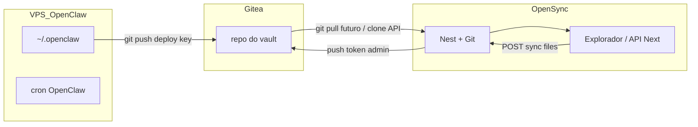

# Arquitetura de sincronização (OpenClaw, Gitea, OpenSync)

## Resultado desejado

1. **Três bases alinhadas:** ficheiros do agente OpenClaw na VPS, repositório Git no Gitea (fonte de verdade versionada), e estado editável na aplicação web OpenSync.
2. **OpenClaw como foco:** o diretório de estado do agente (tipicamente `~/.openclaw`, ou subpastas como `workspace/`) é o que o utilizador quer ver e editar no explorador.
3. **Fluxo do utilizador:** editar no dashboard OpenSync (commit via API existente), e o agente na VPS **atualiza e publica** alterações locais para o mesmo repositório, para o dashboard poder refletir o último estado (pull / reabrir vault).

## Componentes atuais

| Componente | Papel |
|------------|--------|
| **Gitea** | Uma **organização por workspace** (username `ws` + uuid); cada vault é um repo privado `org/repo`, criado em [`GiteaService`](../../apps/api/src/sync/gitea.service.ts). |
| **Nest `VaultGitSyncService`** | Push de um mapa `path → conteúdo UTF-8` a partir do browser: clone shallow, escrita, commit, push ([`vault-git-sync.service.ts`](../../apps/api/src/sync/vault-git-sync.service.ts)). |
| **Next `/api/vaults/[id]/sync`** | Proxy autenticado (Supabase) para `POST /api/vaults/:id/sync`. |
| **SSH / SFTP (legado)** | Import inicial opcional a partir da VPS ([`ssh-workspace-pull.ts`](../../apps/web/src/lib/server/ssh-workspace-pull.ts)); pesado no browser. O caminho preferido a médio prazo é **Git na VPS → Gitea**. |
| **Deploy key (Novo)** | `POST /api/vaults/:id/git/deploy-key` gera par SSH, regista a chave **pública** no Gitea com permissão de escrita, devolve a **privada uma vez** para configurar a VPS. Ver [vault-git-api.md](./vault-git-api.md). |

## Fluxo recomendado (alto nível)

- **Dashboard → Gitea:** já implementado (`pushTextFiles`).
- **VPS → Gitea:** o utilizador configura clone + [script de sync](./scripts/opensync-vps-git-sync.sh) e [cron OpenClaw](./openclaw-agent-sync.md).
- **Gitea → Dashboard (leitura em escala):** planeado como endpoints `git/tree` e `git/blob` na API; até lá o explorador pode usar snapshot local + sync push.

## Segurança (resumo)

- A VPS **não** usa `GITEA_ADMIN_TOKEN`; usa **deploy key** só naquele repositório (ou token com scope mínimo, se adotarem essa variante).
- Chave **privada** mostrada **uma vez** no dashboard; não persistir em claro na base OpenSync.
- `.gitignore` rigoroso na pasta clonada (segredos, caches, `sandboxes`). Ver script e [openclaw-agent-sync.md](./openclaw-agent-sync.md).

## Ligações

- [API vault / Git](./vault-git-api.md)
- [Sincronização com o agente OpenClaw (cron)](./openclaw-agent-sync.md)
- [Script: sync na VPS](./scripts/opensync-vps-git-sync.sh)
